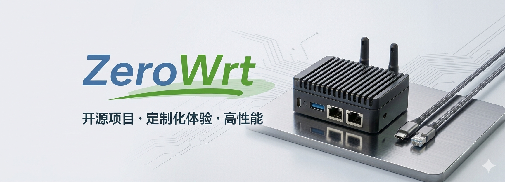

<h1 align="center">✨ ZeroWrt 固件仓库 ✨</h1>

  基于 <strong>ImmortalWrt</strong> 源码编译，适用于 <strong>Qualcommax</strong>、<strong>X86_64</strong>、<strong>Rockchip</strong>、<strong>Amlogic-S9xxx</strong> 平台。 
  <strong style="color:red; font-size:16px;">⚠ 仅限个人自用，严禁商业使用。</strong>

<!-- 技能图标 -->

  
  

  

---

## 固件支持平台类别

本固件基于 **ImmortalWrt** 源码编译，致力于为多种硬件平台提供稳定、高效的开源路由器系统体验，覆盖从嵌入式盒子到软路由设备的广泛应用场景。

| 平台类别              | 平台代号 / 架构                    | 主要特点 / 适用场景                                      | 典型设备示例                          |
|-----------------------|-----------------------------------|-------------------------------------------------------|---------------------------------------|
| **x86_64**            | x86_64 (AMD64)                    | 性能强劲，适合软路由、虚拟机、服务器，扩展性极佳，支持 Docker、KVM 等           | 软路由整机、工控机、VMware、Proxmox、VirtualBox |
| **Rockchip**          | ARMv8 (Cortex‑A53/A72/A76 等)      | 低功耗高性能，适合 ARM 盒子 / 开发板，性价比高，主流 NPU 支持                  | FriendlyARM NanoPi R2S/R4S/R5C/R6C/R6S，Orange Pi 系列等 |
| **Qualcommax**        | ARMv7 / ARMv8 (IPQ60xx/IPQ80xx 等) | 原生支持 NSS 硬件加速，转发性能强悍，适合 Wi‑Fi 6/7 硬路由，高通系专用        | 京东云无线宝（雅典娜/亚瑟/百里等）、GL.iNet、小米 AX9000 等 |
| **Amlogic-S9xxx**     | ARMv8 (Cortex‑A53/A55/A73)         | 电视盒子刷机首选，多媒体性能强，适合一体化家用路由 & 轻 NAS & 影音服务器         | 晶晨 S905X3/S912/S922X 系列盒子（如 HK1、X96、Beelink） |

### 典型功能

- ⚡ **NSS 硬件加速**（Qualcommax 平台）– 大幅降低 CPU 占用，提升小包转发性能。
- 🧩 **全平台软件包支持** – 预置 LuCI、Flow Offload、UPnP、SmartDNS、OpenClash、PassWall 等常用插件。
- 💾 **轻量 & 稳定** – 精简内核配置，针对嵌入式存储优化，减少日志写入，延长闪存寿命。
- 🔄 **自动构建 & 滚动更新** – 跟随 ImmortalWrt 上游更新，定期发布稳定版和快照版。

> ⚠️ 说明：本固件为个人自用编译分享，**不包含任何商业用途授权**。不同平台固件之间互不通用，请根据设备 SoC 架构选择对应镜像。刷机前请务必了解恢复方法和原厂备份，部分 Amlogic 盒子需要先写入专用引导。
